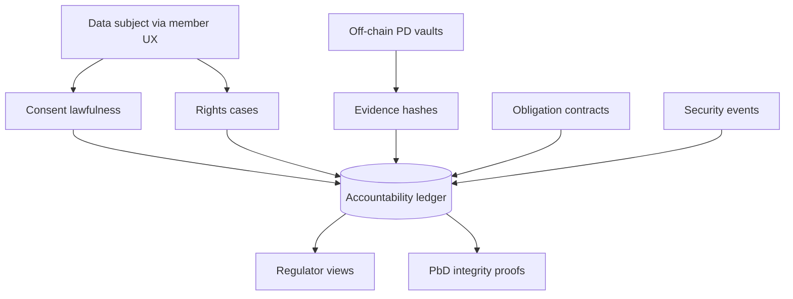

# Consentrail

**Source:** `ai-in-decentralized+ai/ibm-Blockchain and GDPR/`
**Domain:** `ai-decentralized`
**One-liner:** A GDPR accountability rail that records lawful consent, data-subject rights fulfilment, and controller/processor obligations on a permissioned ledger — with personal data kept off-chain and compliance checks automated via policy contracts.
**Wedge:** Multi-party FS and health data exchanges (KYC consortia, clinical-trial consent, owner-mediated health data sharing) that must demonstrate GDPR readiness across IBM’s five areas without putting PD on-chain.
**Positioning:** IBM Security’s five-area GDPR×blockchain operating product. The white paper maps Rights of EU Data Subjects, Security of Processing, Lawfulness and Consent, Accountability of Compliance, and Data Protection by Design/Default to blockchain patterns (Crédit Mutuel KYC views, VChain passenger verification, SecureKey triple-blind, APHP/Inserm trial consent, IBM–FDA owner-mediated health exchange, Northern Trust/Guernsey regulator access, Kimberley-style smart-contract compliance, Guardtime/Stampery integrity proofs). Consentrail is the cross-pillar ops layer — distinct from Oncepass (KYC-reuse UX wedge), Aliaskeep (pseudonym links), Offhash (Fabric field guard), and Forgetcase (Article 17 desk).

## Market research synthesis

### Thesis from source

IBM argues GDPR returns control of personal data to individuals and applies even to non-EU organisations offering goods/services to or monitoring EU residents; partner pressure makes compliance a ticket to trade. Blockchain’s tamper-resistant store and consensus create accountability for how data is managed, and though blockchain (currency without central authority) and GDPR (privacy law) began apart, they align on secured, self-sovereign data (e.g. Decentralized Identity Foundation).

Across five readiness areas the paper is concrete: (1) Rights — portability via shared KYC networks; erasure via off-chain PD + on-chain cryptographic evidence; caveat that consortia must decide who the DPO is. (2) Security of processing — CIA triad via cryptography, access control, no central honeypot, audit trails; SecureKey “triple blind”; still monitor apps, keys, and participant identity. (3) Lawfulness and consent — blockchain workflows for informed consent in clinical trials; owner-mediated health data exchange with unalterable audit trails; never store PD on-chain. (4) Accountability — provenance and consensus for regulators (Guernsey FS Commission near-real-time ledger access); smart contracts automating obligation checks (Kimberley Process demo pattern applied to controller/processor agreements). (5) Data protection by design/default — pseudonymisation/encryption; Estonian eHealth Guardtime integrity; Stampery hash-notary proofs that data existed without publishing raw content. Conclusion: blockchain is not a cure-all but a mechanism to control personal-data use — and the time to start is now (2018 enforcement context).

### Buyer & economic model

- **Primary buyer:** CISO / DPO / Head of Data Privacy working with blockchain programme leads in FS or health consortia.
- **Users:** consent operators, rights desk, compliance analysts, consortium governors, regulators (read views), application security.
- **Budget owner / value metric:** demonstrable GDPR control coverage across the five areas; time to produce regulator-grade evidence; reduction in consent/rights process breaks.
- **Competing status quo:** siloed consent logs in each member’s CRM, paper DPAs, and annual attestations that cannot show near-real-time provenance.

### Domain constraints

- **Regulatory / trust / safety:** GDPR Articles across rights, security, lawfulness, accountability, PbD; sector rules (AML, clinical research, health data); legal counsel required for erasure design.
- **Data sensitivity:** special-category health data in trial/FDA-style exchanges; triple-blind and owner-mediation constraints.
- **Change-management realities:** members keep existing systems of record; Consentrail records evidence and obligation state, not the full clinical or core-banking database.

## Business requirements

- BR-1: The platform must support evidence workflows across all five GDPR readiness areas — rights, security of processing, lawfulness/consent, accountability, and privacy by design — as first-class modules.
- BR-2: Personal data must remain off-chain; only hashes/evidence and process metadata may hit the shared ledger.
- BR-3: Consent capture must support freely given, specific, informed, unambiguous (and explicit where required) records, with withdrawal stopping downstream processing flags.
- BR-4: Data-subject rights requests (access, rectification, erasure, portability, breach inform) must open tracked cases with evidence of fulfilment or lawful refusal.
- BR-5: Consortium setup must record controllership, DPO, and processor roles before live PD processing evidence is accepted.
- BR-6: Security-of-processing controls must log access, key events, and participant identity verification relevant to ledger-connected apps.
- BR-7: Smart-contract-style obligation checks must evaluate controller/processor agreement terms and raise non-compliance events (Kimberley-pattern automation).
- BR-8: Regulators or supervisors with granted roles must receive near-real-time read access to agreed evidence views without receiving raw PD.
- BR-9: Owner-mediated exchange must require data-subject authorisation before member-to-member evidence flows (FDA/Watson Health pattern).
- BR-10: Integrity proofs (Stampery/Guardtime-style) must be generable for process artefacts without publishing plaintext.
- BR-11: Triple-blind attribute exchange patterns must be configurable so attribute providers, consumers, and operators learn only what policy allows.
- BR-12: Legal hold and counsel review gates must exist for erasure conflicts with immutability before operators execute orphaning.

## User stories

Canonical user stories live in sibling [USER_STORIES.md](USER_STORIES.md).

## System design

### Overview

Consentrail provides five modules aligned to IBM’s areas, sharing an evidence ledger and off-chain vaults. Consent and rights cases write proofs; security events attach to participants and apps; obligation contracts evaluate DPA terms; PbD defaults enforce hash-only patterns; regulator views expose agreed slices. Counsel gates mediate erasure orphaning.

### Actors & boundaries

- **Actors:** data subjects (via member UX), DPOs, consent/rights ops, security, compliance, regulators, consortium governors, member apps.
- **Trust boundary:** evidence ledger and obligation state are shared; PD in member vaults; regulators see proofs not plaintext.
- **Human-in-the-loop points:** counsel erasure gates, obligation exception waivers, regulator role grants, high-risk consent.

### Core capabilities

1. **Rights case desk** — access, rectification, erasure, portability, breach inform evidence.
2. **Consent lawfulness** — capture, withdrawal, owner-mediated authorisations.
3. **Security-of-processing log** — access, keys, participant verification events.
4. **Accountability / obligation contracts** — automated compliance checks on DPAs.
5. **Privacy-by-design defaults** — hash-only gates, integrity proofs.
6. **Regulator views** — near-real-time evidence slices.
7. **Consortium role registry** — controller/processor/DPO.
8. **Triple-blind exchange mode** — attribute verification privacy.

### Conceptual data

- **Primary entities:** ConsortiumRole, ConsentRecord, RightsCase, EvidenceHash, SecurityEvent, ObligationContract, ComplianceAlert, RegulatorView, IntegrityProof, OwnerMediationGrant.
- **Critical events:** consent given/withdrawn, rights case opened/closed, obligation breached, erasure orphaned, regulator view granted, integrity proof issued.
- **Retention / audit needs:** accountability artefacts for GDPR demonstration periods; PD retained only in member vaults per policy.

### Integrations (conceptual)

- **Systems of record:** member CRM/KYC/EHR, DPA repositories, SIEM, ticketing for rights.
- **Upstream signals:** eID/SSI, clinical eConsent, SecureKey-like attribute providers.
- **Downstream actions:** processing-stop flags, regulator notifications, counsel workflows, member app blocks on obligation breach.

### High-level architecture

### Success metrics

- **Leading:** % of five-area controls with current evidence; consent withdrawal propagation time; obligation alerts acknowledged within SLA.
- **Lagging:** regulator information requests answered from rail vs manual hunt; rights SLA breaches; PD-on-chain policy violations; DPA exceptions outstanding.

## OpenAPI skeleton

Canonical HTTP surface lives in sibling [openapi.yaml](openapi.yaml). Summary:

- **Base path:** `/v1/...`
- **Auth:** `X-API-Key` for member systems; Bearer JWT for privacy operators; scoped regulator credentials.
- **Resource groups:** Consents, Rights, SecurityEvents, Obligations, Evidence, RegulatorViews.
