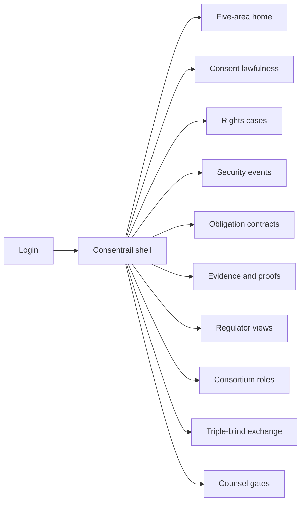
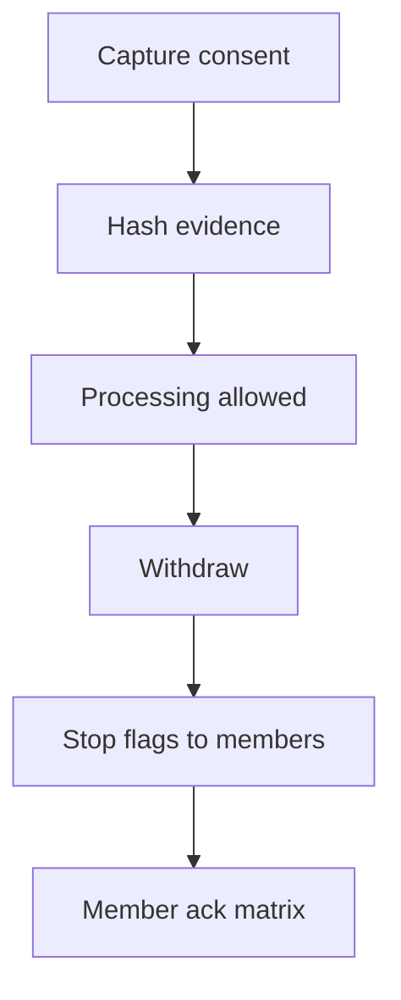

# Consentrail — Web app

**Product:** [PRODUCT.md](./PRODUCT.md)
**Primary surface:** Five-pillar GDPR accountability console for FS/health consortia
**Secondary surfaces:** Regulator evidence view (scoped read-only); counsel erasure gate inbox
**Design thesis:** Consentrail is a railway switchyard for GDPR evidence — five tracks (rights, security, lawfulness, accountability, PbD) sharing one ledger of proofs, never a pile of PD. The UI metaphor is a control tower over track status lights: green means evidence current; amber means gap; coral means obligation breach or counsel hold. Visual language is cool rail-slate and signal-teal on deep ink; the Consentrail wordmark sits as a quiet signal lamp on every five-area screen so DPOs know whose accountability trail they are reading.

## UX research synthesis

### Category peers (best-in-class)

- **OneTrust / TrustArc privacy ops:** Control frameworks mapped to evidence, rights case desks, consent withdrawal propagation. Steal: readiness modules as first-class nav with gap scores — not a single blended “privacy score.”
- **Veeva / Medidata eConsent (clinical):** Fine-grained trial consent and audit. Steal: clinical-grade consent parameters and owner-mediated share scopes; reject consumer cookie-banner UX for health/FS consortia.
- **ServiceNow GRC / Archer:** Obligation tracking and exception workflows. Steal: DPA term → automated non-compliance event → acknowledge SLA; reject ITSM ticket walls as the only home.
- **Northern Trust / Guernsey-style regulator portals (pattern):** Near-real-time supervisor views without raw books. Steal: scoped evidence slices for regulators with zero PD columns.

### Patterns to adopt / reject

- **Adopt:** Five-area home as the DPO default; hash-only evidence ledger; consent withdraw → processing-stop flags; rights cases with fulfilment/refusal evidence; obligation contracts with Kimberley-style checks; regulator views; triple-blind exchange config; counsel gate before erasure orphaning.
- **Reject:** Single vanity compliance score; PD on-chain explorers; cookie CMP as the product; purple AI “GDPR autopilot”; editable historical evidence; regulator access to vault plaintext.

### Trust, density, and workflow constraints from PRODUCT.md

All five IBM readiness areas must be first-class (BR-1); PD stays off-chain (BR-2). Controllership/DPO roles block go-live until recorded (BR-5). Withdrawal must stop downstream processing flags (BR-3). Regulators get near-real-time proofs without PD (BR-8). Owner-mediated flows require subject authorisation (BR-9). Erasure conflicts with immutability need counsel gates (BR-12). Density is programme-ops: control evidence grids, not marketing dashboards.

## Information architecture

### Nav model

### Roles → default home

| Role | Default home | Why |
|------|--------------|-----|
| DPO / privacy lead | Five-area home | Evidence gaps across pillars (BR-1) |
| Consent operator | Consent lawfulness | Capture / withdraw (BR-3) |
| Rights operator | Rights cases | DSR fulfilment (BR-4) |
| Security officer | Security events | Access/key/participant logs (BR-6) |
| Compliance analyst | Obligation contracts | DPA breach alerts (BR-7) |
| Regulator liaison | Regulator views | Supervisor slices (BR-8) |
| Consortium governor | Consortium roles | Controllership before go-live (BR-5) |

### Cross-links to OpenAPI resources

| Nav area | OpenAPI tags / resources |
|----------|---------------------------|
| Consent lawfulness | Consents |
| Rights cases | Rights |
| Security events | SecurityEvents |
| Obligation contracts | Obligations |
| Evidence / integrity proofs | Evidence |
| Regulator views | RegulatorViews |

## Screen inventory

### Five-area home

- **Purpose:** Show GDPR readiness across rights, security, lawfulness, accountability, PbD with evidence gaps — not slideware.
- **Entry:** DPO login default.
- **Layout regions:** Brand + consortium; five track panels with status and gap list; open counsel holds; obligation breach strip; deep links into modules.
- **Primary actions:** Open gap; export readiness pack; jump to roles if incomplete.
- **Empty / loading / error:** Incomplete roles = blocking banner before “live”; loading = skeleton tracks.
- **BR / story ties:** BR-1, BR-5; DPO stories.

### Consent lawfulness

- **Purpose:** Capture freely given, specific, informed, unambiguous (explicit where required) consent; withdraw stops processing.
- **Entry:** Nav → Consent; clinical/eConsent integrations.
- **Layout regions:** Consent list; capture form (purpose, share parameters); withdrawal control; processing-stop flag status to members.
- **Primary actions:** Capture; withdraw; notify members of stop flags.
- **Empty / loading / error:** Empty = start clinical or KYC consent template; withdraw fail = coral retry.
- **BR / story ties:** BR-3; consent operator stories.

### Owner-mediated authorisation

- **Purpose:** Require data-subject authorisation before member-to-member evidence flows.
- **Entry:** From consent detail; health/KYC exchange request.
- **Layout regions:** Requesting member; scope; subject approve/deny; audit trail pane.
- **Primary actions:** Approve share; deny; expire grant.
- **Empty / loading / error:** No subject auth = flow blocked.
- **BR / story ties:** BR-9.

### Rights case desk

- **Purpose:** Track access, rectification, erasure, portability, breach-inform with fulfilment or lawful refusal evidence.
- **Entry:** Nav → Rights.
- **Layout regions:** Case queue by type/SLA; case detail with evidence refs; refusal lawful-basis panel; portability pack builder (references only).
- **Primary actions:** Open case; attach evidence; close fulfilled/refused; hand to counsel for erasure.
- **Empty / loading / error:** Empty = “no open rights cases”; SLA breach = amber.
- **BR / story ties:** BR-4.

### Counsel erasure gate

- **Purpose:** Mediate erasure vs immutability before orphaning hashes.
- **Entry:** Rights erasure cases; counsel inbox.
- **Layout regions:** Conflict brief; legal hold toggle; approve orphan / refuse with basis; post-decision orphan status.
- **Primary actions:** Approve orphaning; refuse; place legal hold.
- **Empty / loading / error:** Empty = no pending gates.
- **BR / story ties:** BR-12.

### Security-of-processing log

- **Purpose:** Log access, key events, and participant identity checks for ledger-connected apps.
- **Entry:** Security officer home.
- **Layout regions:** Event stream; filters (app, participant, key); impersonation alerts; CIA checklist chips.
- **Primary actions:** Acknowledge alert; export SIEM feed; open participant verify.
- **Empty / loading / error:** Empty = healthy quiet state with last-heartbeat.
- **BR / story ties:** BR-6.

### Obligation contracts

- **Purpose:** Automate controller/processor agreement checks; raise non-compliance events.
- **Entry:** Compliance default.
- **Layout regions:** Contract list; term checklist; alert queue; exception waiver with expiry.
- **Primary actions:** Acknowledge breach; waive with counsel note; block member app on critical breach.
- **Empty / loading / error:** No contracts = cannot mark accountability green.
- **BR / story ties:** BR-7.

### Evidence and integrity proofs

- **Purpose:** Manage hash evidence and Stampery/Guardtime-style proofs without publishing plaintext.
- **Entry:** Nav → Evidence.
- **Layout regions:** Evidence table; proof generator; PD-ban seal; download proof package.
- **Primary actions:** Issue proof; verify proof; attach to rights/consent case.
- **Empty / loading / error:** PD detected in payload = block hash write.
- **BR / story ties:** BR-2, BR-10.

### Regulator views

- **Purpose:** Near-real-time supervisor evidence slices with zero raw PD.
- **Entry:** Regulator liaison; scoped regulator login.
- **Layout regions:** Granted view list; live evidence feed; column policy (proofs only); grant/revoke regulator role.
- **Primary actions:** Open view; export period; request expanded scope (governed).
- **Empty / loading / error:** No grant = access denied explanation.
- **BR / story ties:** BR-8.

### Consortium roles

- **Purpose:** Record controller, processor, DPO before live PD processing evidence is accepted.
- **Entry:** Governor home; blocking from five-area home.
- **Layout regions:** Role matrix; DPO contact; go-live gate status.
- **Primary actions:** Assign roles; attest; unlock evidence acceptance.
- **Empty / loading / error:** Missing DPO = hard block.
- **BR / story ties:** BR-5.

### Triple-blind exchange config

- **Purpose:** Configure attribute verification so providers, consumers, and operators learn only policy-allowed facts.
- **Entry:** Governor / security advanced.
- **Layout regions:** Party roles; attribute allow-lists; blindness matrix preview; test exchange.
- **Primary actions:** Save policy; run dry-run; disable mode.
- **Empty / loading / error:** Misconfig = cannot enable live.
- **BR / story ties:** BR-11.

### Processing-stop monitor

- **Purpose:** Prove consent withdrawal propagated as stop flags to member systems.
- **Entry:** From consent withdraw; DPO alerts.
- **Layout regions:** Member ack matrix; latency; failed pushes.
- **Primary actions:** Retry push; open member incident.
- **Empty / loading / error:** Incomplete ack = amber SLA.
- **BR / story ties:** BR-3.

## Key flows

1. **Consent → withdraw → stop** — capture → ledger evidence → withdraw → processing-stop flags → member acks; failure: unacked members stay amber (BR-3).

2. **Rights fulfilment** — open case → gather evidence refs → fulfil or lawful refuse → close; erasure path → counsel gate → orphan (BR-4, BR-12).

3. **Obligation breach** — contract term fails check → alert → acknowledge/waive/block app (BR-7).

4. **Regulator read** — grant scoped view → near-real-time proofs → export without PD (BR-8).

5. **Owner-mediated share** — member requests → subject authorises → evidence flow; deny blocks (BR-9).

## Design system

### Tokens (CSS variables)

- `--color-ink: #E7EEF4` — primary text
- `--color-ink-950: #0A1018` — app ground
- `--color-slate-900: #141C28` — panels
- `--color-rail: #6B7C8F` — secondary labels
- `--color-signal: #2BBBAD` — evidence current / track green (signal-teal)
- `--color-signal-dim: #1A6E66`
- `--color-amber: #E0A12B` — evidence gap / SLA
- `--color-coral: #E85D4C` — obligation breach / counsel hold
- `--color-brand: #8FD9D0` — Consentrail wordmark
- `--font-display: "Neue Haas Grotesk Display", "Montserrat", sans-serif` — five-area titles
- `--font-body: "IBM Plex Sans", sans-serif`
- `--font-mono: "IBM Plex Mono", monospace` — evidence ids, proofs
- `--space-1`…`--space-8`: 4px scale
- `--radius-sm: 4px`; `--radius-md: 8px`
- `--motion-signal: 180ms ease-out` — track status flip
- `--motion-breach: 280ms ease-in-out` — coral pulse on obligation alert
- Atmosphere: subtle parallel “rail” lines in slate-900; soft top vignette; no stock courthouse photos.

### Typography & brand

- Display for five-area titles; mono for hashes and proof ids.
- Brand signal-lamp left of chrome on every pillar screen; five-area home title never outranks Consentrail.
- Login: brand hero, one headline (“Five tracks. One accountability rail.”), one CTA.

### Do / don’t

- **Do:** Keep five modules visible; PD-ban on every evidence write; counsel before orphan; regulator columns proof-only.
- **Don’t:** Purple AI glow; single blended score as the product; cookie-banner metaphors; editable ledger history; card spam for static controls.

### Accessibility & domain trust cues

- AA+ on signal/amber/coral vs ink; status never colour-only — text labels on tracks.
- Live regions for obligation breaches and withdrawal propagation.
- Focus order: roles → consent → rights → obligations → regulator.
- Integrity proofs downloadable as machine-readable packs.

## Component patterns

- **FiveAreaTrackPanel** — status, gaps, deep link per IBM pillar.
- **ProcessingStopFlagMatrix** — member ack after withdraw.
- **RightsCaseTimeline** — fulfilment / refusal evidence.
- **CounselHoldBanner** — erasure blocked pending legal.
- **ObligationAlertRow** — term breach + waiver expiry.
- **RegulatorSliceView** — proof columns only.
- **IntegrityProofCard** — hash-notary without plaintext.
- **TripleBlindMatrix** — who learns which attributes.
- **RoleGoLiveGate** — controllership/DPO lock.

## Out of scope for v1 web

- Full EHR/CRM replacement; consumer mobile consent app beyond deep links; cookie CMP; Fabric peer ops; Oncepass KYC-reuse desk; Aliaskeep link vault replacement; native regulator mobile apps.
